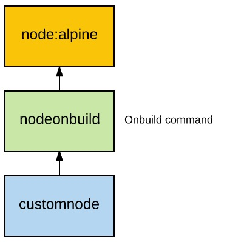

# Demo docker onbuild

Onbuild sẽ chạy lệnh khi build container con chứa không vào thời điểm build 
container cha mà vào thời điểm image kế thừa nó được build
Cấu trúc mã nguồn

```
├── Dockerfile
├── ReadMe.md
└── onbuild
    ├── Dockerfile
    └── myweb
        ├── chuoi.txt
        ├── fun.js
        ├── fun.txt
        ├── index.js
        ├── package.json
        └── yarn.lock
```

Dockerfile của nodeonbuild kế thừa từ node:alpine
```dockerfile
FROM node:alpine

RUN mkdir -p /usr/src/app

WORKDIR /usr/src/app

ONBUILD COPY ./myweb/package.json /usr/src/app/

ONBUILD RUN npm install

ONBUILD COPY ./myweb /usr/src/app

CMD [ "npm", "start" ]


```

Tạo docker image có tên nodeonbuild
```docker build -t nodeonbuild .```

Dockerfile của customenode trong thư mục onbuild
```dockerfile
FROM nodeonbuild:latest
EXPOSE 3000
```

```
docker build -t customnode .
docker run -d --name customnode -p 3000:3000 customnode:latest
curl http://localhost:3000
```

Khi image customnode được build thư mục myweb sẽ được copy vào /usr/src/app trong image. Nếu trong myweb có node_modules thì số lượng file copy sẽ rất lớn. Do đó hãy tạo .dockerignore như sau. Nó sẽ không COPY node_modules, .DS_Store, các file markdown và txt ở thư mục myweb vào docker image trong quá trình build.
```
myweb/node_modules
.DS_Store
myweb/*.md
myweb/*.txt
```

Kiểm tra nội dung thư mục /usr/src/app
```
docker exec -it customnode ls
# ls
```


